# plesk
En esta práctica vamos a crear un servidor *Plesk* para Hosting Compartido

## Creación de la instancia:
Necesitaremos crear una nueva instancia en AWS, las características:
- Nombre de la instancia: plesk_fms
- Almacenacimiento: 40 GB de disco duro
- Grupo de seguridad: sg_plesk

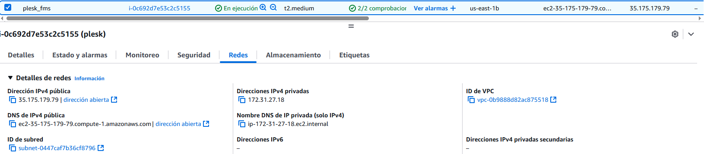

Despues tenemos que crear un **grupo de seguridad** con el nombre de **sg_plesk** con las siguientes reglas de seguridad:
- 22: SSH (TCP)
- 80: HTTP (TCP)
- 443: HTTPS (TCP)
- 21: FTP (TCP) - Puerto de control en los modos activo y pasivo
- 20: FTP (TCP) - Puerto de datos en el modo activo
- 49152 - 65535: Rango de puertos dinámicos para el modo pasivo (TCP)
- 25: SMTP (TCP)
- 465: SMTPS (TCP)
- 143: IMAP (TCP)
- 993: IMAPS (TCP)
- 110: POP3 (TCP)
- 995: POP3S (TCP)

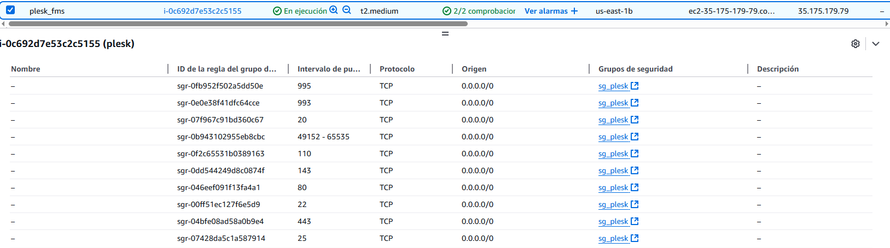

## Despliegue del servidor
Ahora pasaremos a la instalación del servidor Plesk, para ello lanzameros el script de **servidor.sh**

```bash
# Descargamos las dependecias de plesk
wget https://autoinstall.plesk.com/plesk-installer

# Le damos permisos de ejecución 
chmod +x plesk-installer

# Ejecutamos el instalador
./plesk-installer install plesk
```
Y esperamos aproximadamente 10 minutos para que se complete la instalación

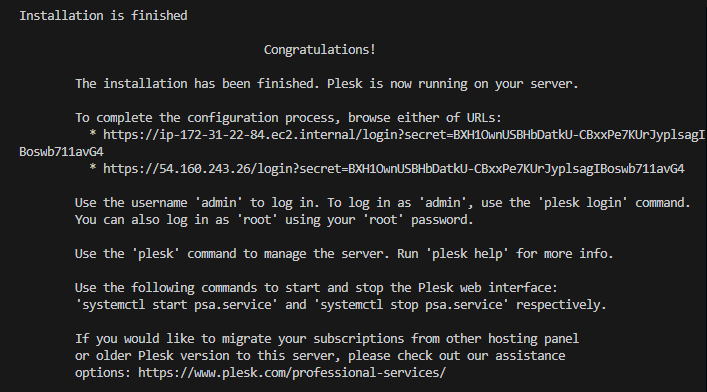

Ahora con la instalación completa, nos dan dos enlaces, copiamos uno de ellos y lo pegamos al navegador y nos aparece la página de configuración del admin.

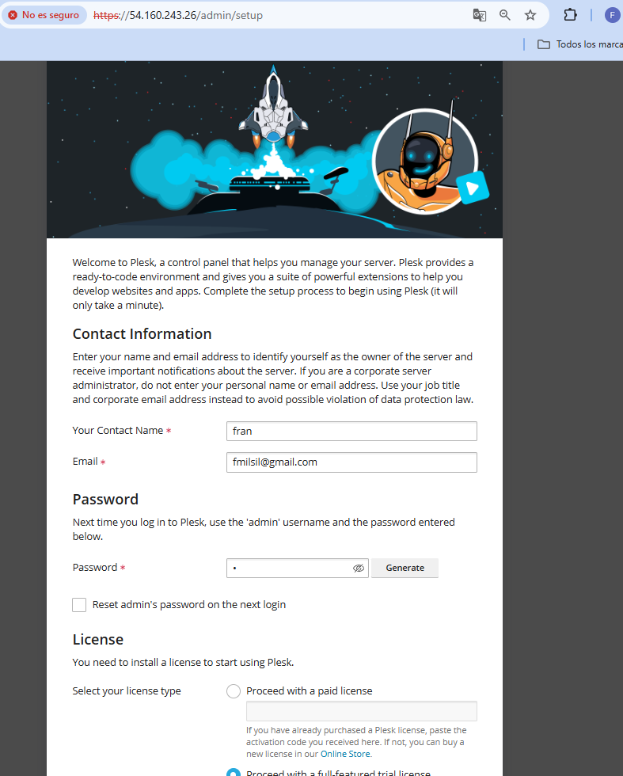

## Administración de sitios
Ahora nos aparece esto en nuestra página:

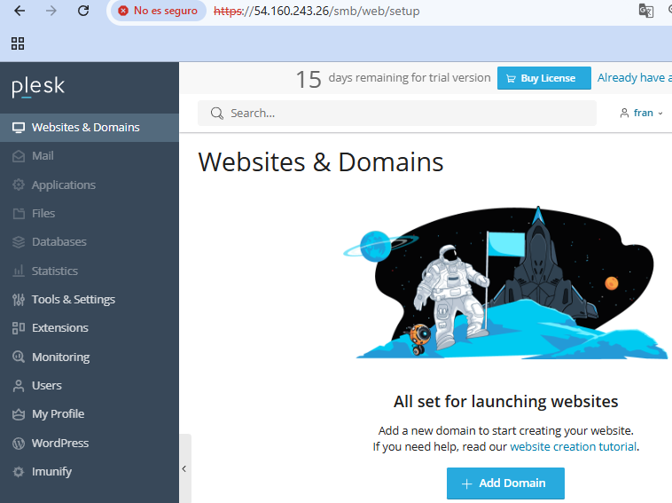

Vamos a crear un nuevo dominio, para ello pinchamos en **Add Domain** donde podremos crear una página, le damos en **Blank website**.

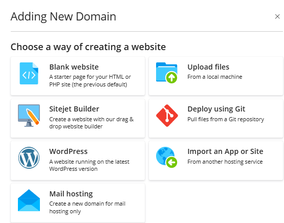

Una vez creado nuestro dominio nos aparecera un dashboard propio de nuestra nueva web

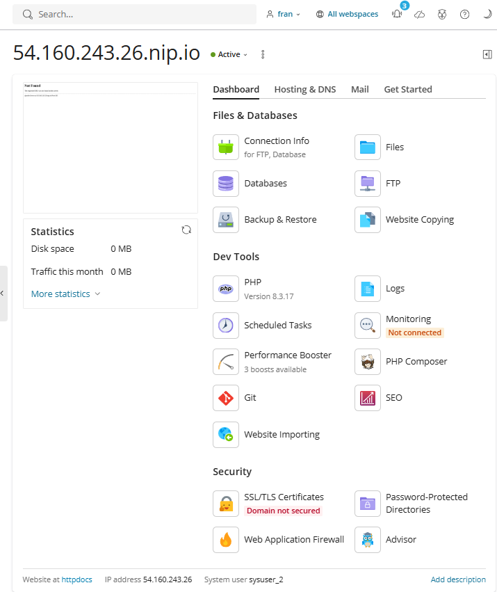

Nosotros nos interesa crear un sitio virtual, para crearlo nos dirigimos en **file** donde podremos subir nuestro archivos para la página.

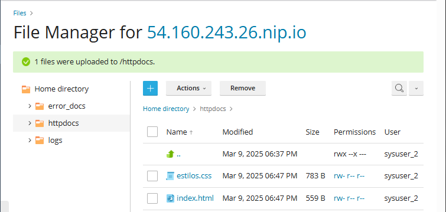

Y nos quedaria algo asi:

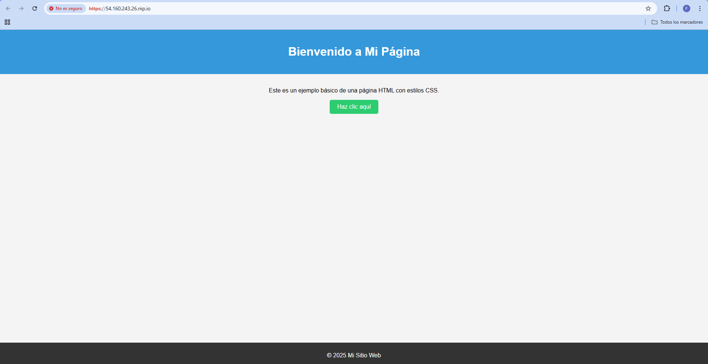

## Instalación de un sitio Wordpress
Ahora vamos a instalar un Wordpress. Para ello señalamos la instalación **WordPress**.

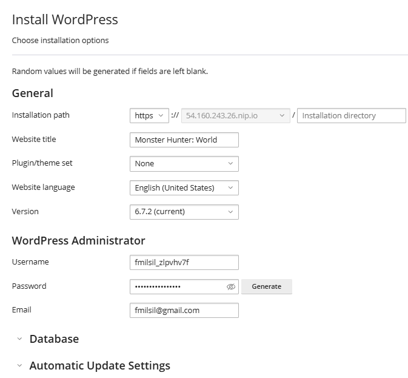

Esperamos a que se complete la descarga y podemos echarle un vistazo a nuestro WordPress.

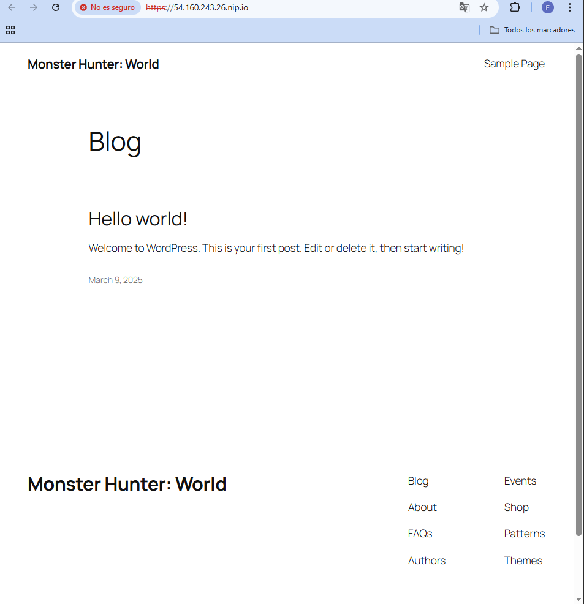

## Seguridad del sitio
Podemos ver como nuestro sitio nos aparece que no posee un **certificado SSL/TLS**. Para solucionar esto vamos a pedir uno, el que certificado que vamos a usar es el **Let's Encrypt** (utilizado anteriormente en nuestras prácticas).

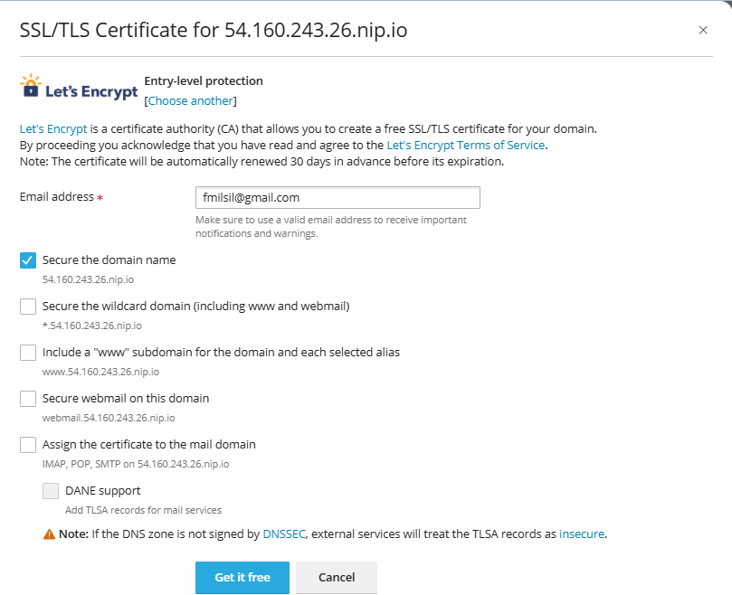

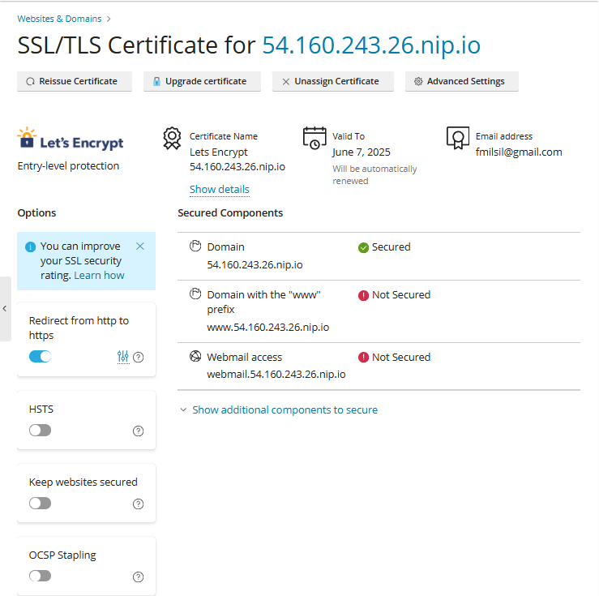

Por último podemos ver y actualizar la seguridad de nuestro sitio.

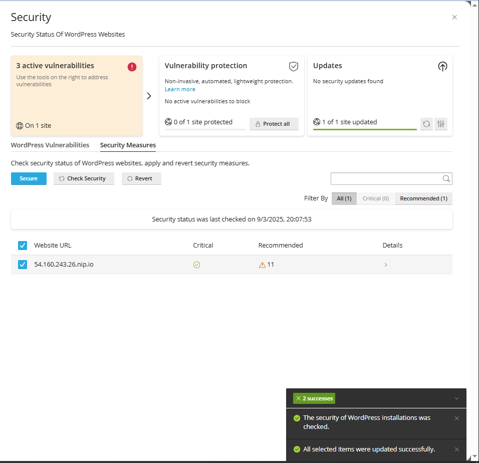
